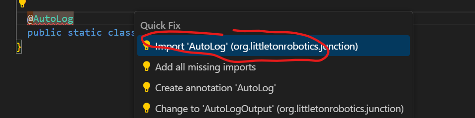

# Create IntakeIO.java

## What you'll need

* [ ] A computer with WPILib installed
* [x] Internet connection
* [ ] The previously downloaded AdvantageKit\_TalonFXSwerveTemplate robot code

## What are we doing?

Our goal is to add an intake subsystem to AdvantageKit\_TalonFXSwerveTemplate. This is a simple subsystem with only one motor. We will be able to spin a wheel forwards and backwards to grab or release a game item.

> #### Press the 'A' button on our game controller so that the subsystem intakes. Press the 'B' button so that the subsystem ejects.

The more specific your goal, the better.

> #### Press the 'A' button on our game controller so that the intake motor voltage goes to 12 volts. Press the 'B' button so that the motor voltage goes to -12 volts. The motor voltage goes back to 0 volts when we let go of the button&#x20;

Review of what we need to do in order to get to our goal:



### Create IO

We need this to record what the intake does. We also need this to make sure our sim and real robot acts identically.



### Create IOSim

Even when we don't have a real robot, we want to see if the right things happen when we press the buttons.



### Create Subsystem file&#x20;

We need this so that the motor knows what 'spin forwards', 'spin backwards' and 'stop' means.



### Add Commands to RobotContainer

We need this so that our robot code knows the 'A' and 'B' buttons control the intake motor.



## Setting up IntakeIO.java

Open WPILib VS Code and open AdvantageKit\_TalonFXSwerveTemplate.&#x20;

Open src >> main >> java >> frc >> robot >> subsystems. Notice there is already a folder inside subsystems called drive for the Drive Subsystem.

Right click on the folder subsystems >> New Folder...

We will rename our new folder to intake.


When programming, capitalization matters! It's good to start a habit now of noticing how things are capitalized.


<figure><figcaption></figcaption></figure>

Right click the folder intake >> Create a new class/command

<figure><figcaption></figcaption></figure>

The Command Center prompts you to Pick a command. We want to select the command:

```
Empty Class Create an empty class
```

<figure><figcaption></figcaption></figure>

The Command Center prompts you to Please enter a class name. Type in IntakeIO and press enter.

Here is the code that will show up on your screen:


```java
// Copyright (c) FIRST and other WPILib contributors.
// Open Source Software; you can modify and/or share it under the terms of
// the WPILib BSD license file in the root directory of this project.

package frc.robot.subsystems.intake;

/** Add your docs here. */

public class IntakeIO {}
```


At the very bottom of the code, replace `class` with `interface` so that the code looks like:


```java
// Copyright (c) FIRST and other WPILib contributors.
// Open Source Software; you can modify and/or share it under the terms of
// the WPILib BSD license file in the root directory of this project.

package frc.robot.subsystems.intake;

/** Add your docs here. */

public interface IntakeIO {}
```


### Code breakdown #1

‼️Most important concepts to know

<details>

<summary>‼️Comments</summary>

When the computer compiles and runs the code, it ignores any words typed in the same line after `//`. The computer also ignores any words sandwiched between `/*` and `*/` .

We call it a **comment**. You can 'comment out' a section of code that you want the computer to ignore.


```java
// Copyright (c) FIRST and other WPILib contributors.
// Open Source Software; you can modify and/or share it under the terms of
// the WPILib BSD license file in the root directory of this project.
```


When we create a new file, these comments are automatically generated at the top.&#x20;


```java
/** Add your docs here. */
```


This means something like, "You should always write comments in your code describing what it does to make it easier for new people to look at the code later." So we might replace "Add your docs here" with something like "interface for the intake subsystem".

</details>

<details>

<summary><code>package</code></summary>

Remember how in order to get to our subsystem folder we had to go through src >> main >> java >> frc >> robot >> subsystems. Then we added another folder inside subsystems called intake. The computer doesn't know we separated our files into different folders.

This line of code helps the computer understand where our file is located.

Try opening up a file inside of src >> main >> java >> frc >> robot, for example RobotContainer.java. You will see this because RobotContainer.java is inside the robot folder:


```java
package frc.robot;
```


Try opening up a file inside of src >> main >> java >> frc >> robot >> subsystems >> drive, for example ModuleIO.java. You will see this because ModuleIO.java is inside the drive folder:


```java
package frc.robot.subsystems.drive;
```


</details>

<details>

<summary>Access Modifier</summary>

Access modifiers change which code can be seen by other code.&#x20;


```java
public interface IntakeIO {}
```


In this case, the access modifier is changing whether other files can see the IntakeIO.java interface or not. We will be applying access modifiers to other things such as specific code inside of our files.

Our IntakeIO interface needs to be public, because it is our template. If it is private, then our SIM and REAL files won't be able to see our template.


Any top-level interface must always be public.&#x20;

A top-level interface is an interface with a file name that matches the interface inside of it.

Our file is IntakeIO.java and the interface inside of it is called IntakeIO, that means IntakeIO is a top level interface.


</details>

<details>

<summary><code>interface</code></summary>


```java
public interface IntakeIO {}
```


An interface is like a template for our code. We will use IntakeIO to make IntakeIOSim and IntakeIOTalonFX.

Maybe while we are making IntakeIOSim, we forget to add something that should be there based on how we made the IntakeIO template.

Now the computer will get upset if we try to run IntakeIOTalonFX until we add the thing that is missing.

</details>

<details>

<summary>Braces</summary>

Our code will need to be inside these curly brackets `{}` called braces so that the computer will properly read the code.

</details>

Once you familiarize yourself with everything above, let's add some code to the interface.

## Add a static nested class with variables for AutoLog

Compare the code below to your current IntakeIO.java file, then add the code missing from your file so that it matches the code below:


```java
// Copyright (c) FIRST and other WPILib contributors.
// Open Source Software; you can modify and/or share it under the terms of
// the WPILib BSD license file in the root directory of this project.

package frc.robot.subsystems.intake;

import org.littletonrobotics.junction.AutoLog;

/** An interface for the intake subsystem */
public interface IntakeIO {

  @AutoLog
  public static class IntakeIOInputs {
    public double intakePositionRadians = 0.0;
    public double intakeVelocityRadiansPerSeconds = 0.0;
    public double intakeAppliedVoltage = 0.0;
    public double intakeCurrentAmperage = 0.0;
  }
}
```


### Code breakdown #2

‼️Most important concepts to know

<details>

<summary><code>import</code></summary>

Remember in the previous lesson we went to the leftmost column and clicked the WPILib icon (Vendor Dependencies) Someone already wrote a lot of code for us so that we don't have to write it from scratch. We can just import it instead.


Hold Control + click on .`AutoLog` at the very end of the line `import org.littletonrobotics.junction.AutoLog;`

Java will open up the AutoLog code for us to look at. This shortcut is useful and will be used a lot.

Mac users use Command (⌘) + click


**How do we know what we need to import?**&#x20;

It depends on what your code need. It's difficult to memorize every single import but you will get a better sense of what you need with the more code you write.

**How do you know exactly what to type after `import`?**

We can look up documentation online for the code we need.

While you write code, VS Code will automatically help you add imports. Try deleting the `import` line from your code (or commenting it out)

<figure><figcaption></figcaption></figure>

You will see some wavy underline appear under `@AutoLog`.

Hover over the wavy underline and VS Code will prompt, "AutoLog cannot be resolve to a type". Click the option **Quick Fix...** and then click **Import 'AutoLog' (org.littletonrobotics.junction)**

Java will pop in the import you need to be able to use @AutoLog.

You can use this Quick Fix to import other files as well.

</details>

<details>

<summary><code>@AutoLog</code> (not <code>@Autolog!</code>)</summary>

This is something special to AdvantageKit that allows us see our data in AdvantageScope.

You'll put this in your IO above everything you want to check in your simulation.

The first time you build/simulate your code after adding @AutoLog, AdvantageKit will automatically create some new files so we can see the data in AdvantageScope.

</details>

<details>

<summary>‼️Variables</summary>

Data is crucial for programming!

A variable is a container that contains data. It has four components:



### (optional, kinda) The access modifier

The access modifier changes which code can see this variable.

Here are some access modifiers used frequently in FRC programming:

* `public` - this variable can be seen (and changed!) by any files in your program.
* `private` - this variable can only be seen by the section of code it's inside.



### A data type: the kind of data stored in the variable

Here are some data types used frequently in FRC programming:

* `double` - decimal number (`19.99`, `20.0`)
* `bool` - boolean, contains either `true` or `false`
* `int` - integer, or whole number (`3`, `1000`)



### A name

Also called an identifier. Every variable in a section of code must have a different name. It is most helpful to name the variable something that describes the purpose of the variable.



### (optional, kinda) The value

The actual data inside the value.

An integer variable must always contain an integer. A double must always contain a decimal. A boolean must contain true or false.&#x20;

We can change the value of a variable with `=`.&#x20;

`=` means "is changed to the value of".



Let's look at this code:


```java
public double intakePositionRadians = 0.0;
```


* **Access modifier:** This is a `public` variable (can be seen by other files).
* **Data type:** `double` - we want it to contain a decimal value.
* **Name/Identifier:** `intakePositionRadians` - this is a variable for the intake subsystem, and it will contain the position of the motor in radians.&#x20;


360° = 2π radians, about 6.28 radians


* **Value:** We give `intakePositionRadians` a value of `0.0` using `=` (`intakePositionRadians` is changed to the value of `0.0`)

</details>

<details>

<summary><code>static nested class</code></summary>

```java
public static class IntakeIOInputs {
```

To explain the meaning of `static` we need to know the difference between a `class` and an `object`.&#x20;

* We start with an `interface`, IntakeIO.java.
* We create the `class` IntakeIOSim.java from IntakeIO.java with code to run for the sim.


Classes are only blueprints, and they cannot run the code they contain. The variables inside a class will only exist once an object is created from that class.


* Inside of Intake.java (the subsystem file), we create an `object` from the `class` IntakeIOSim. Now we can run the code!

Inside of IntakeIO, we have a class called `IntakeIOInputs` with four variables that we need data from.&#x20;

We put `static` on the class `IntakeIOInputs` so that we don't need to make an object in order for these four variables to exist. Now they will be created when we start the robot code.

**So why not make a separate IntakeIOInputs.java file to put the IntakeIOInputs class inside?**

Yes, you can do that. But we put the class IntakeIOInputs inside the interface IntakeIO so that we have less files to keep track of. It's easier to find the variables in the static class when they are put in the context of where it needs to be used.

</details>

## Add Methods

Compare the code below to your IntakeIO.java file, then add the code missing from your file so that it matches the code below:


```java
// Copyright (c) FIRST and other WPILib contributors.
// Open Source Software; you can modify and/or share it under the terms of
// the WPILib BSD license file in the root directory of this project.

package frc.robot.subsystems.intake;

import org.littletonrobotics.junction.AutoLog;

/** An interface for the intake subsystem */
public interface IntakeIO {

  @AutoLog
  public static class IntakeIOInputs {
    public double intakePositionRadians = 0.0;
    public double intakeVelocityRadiansPerSeconds = 0.0;
    public double intakeAppliedVoltage = 0.0;
    public double intakeCurrentAmperage = 0.0;
  }
  
  public default void updateInputs(IntakeIOInputs inputs) {}

  public default void setIntakeVoltage(double voltage) {}
}
```


‼️Most important concepts to know

<details>

<summary>‼️What is a method?</summary>

Instead of rewriting the same code over and over again, we can put it inside a **method**.

A method is a block of code that runs every time we call it, or ask our code to run it. You might call a method in a different code file, or inside the same file.

</details>

<details>

<summary>‼️Method components</summary>

There are five components to a method. Let's use the second method in this interface as an example:


```java
public default void setIntakeVoltage(double voltage) {}
```




### Modifier


```java
public default
```


`setIntakeVoltage` is `public`, so other files can access this method. If we change `public` to `private`, then only the file that contains the `private` method can use that method.

`default` is a special interface keyword. Remember that every time we make a SIM or REAL class based on our interface, Java will get upset if that class isn't the same as the interface. Every method in an interface must also be in that SIM or REAL class.

Now we get into this scenario where every time we use an interface as a template for some class, we have to write code for every. Single. Method. Every time for those classes. Because Java will get upset if there is nothing inside of there. (Or worse the code will run and everything will seem okay until the code crashes and burns)

We can add `default` to methods in an interface which tells Java "Hey, you can use the stuff written inside of the interface's method as a backup." In our case, there's nothing inside the curly brackets, but that is what we want our backup methods to do: safely do nothing.



### Return Type


```java
void
```


Sometimes we want to call a method and have it give us some data. The method can give us, or "return" the same data types as variables.

Usually every method in an IO interface is `void`.


Data coming from the robot goes into the SubsystemIOInputs class as variables.

Commands going to the robot are `void` methods in the IO interface.


Some return types used frequently in FRC programming:

* `void` - sometimes we don't need our method to give us anything at all. This return type won't return any data.
* `int`
* `double`
* `bool`



### Method Name


```java
setIntakeVoltage()
```


Name of the method, written in camelCase. `youShouldTypeYourMethodNameLikeThis`



### (optional) Parameters


```java
double voltage
```


This is the thing inside the parentheses. Each parameter needs a data type and a name.

Let's say you want to tell the method `setIntakeVoltage` to set the motor to 12 volts, maximum voltage. We can make `setIntakeVoltage` require a parameter, `double voltage`. Then we can say `double voltage` is 12 volts.

But then we want to set the motor to 0 volts, aka we want it to stop. Instead of rewriting the code (and making some inevitable typo), we just call the method `setIntakeVoltage` again, and instead of saying `double voltage` is 12 volts we say that `double voltage` is 0 volts.

Sometimes a method has no parameter. Sometimes a method has several parameters.


```java
public default void setIntakeVoltage(double voltage1, double voltage2, double voltage3) {}
```


Remember that every variable in a block of code needs a different name, so every parameter in a method needs a different name.


```java
// this method won't work!
public default void setIntakeVoltage(double voltage, double voltage, double voltage) {}
```


The data type of the parameters of a method might not be the same.


```java
public default void setIntakeVoltage(bool someRandomBooleanName, double voltage) {}
```



Parameters are optional depending on what your method needs (if it needs parameters at all).




### Method Body


```java
{}
```


Inside the curly brackets will be the code that we don't want to write over and over again. Because this is our IntakeIO interface, our template, the method body is blank.

When we write our method `setIntakeVoltage` in IntakeIOSim, our method `setIntakeVoltage` will contain code that changes the voltage of a virtual motor.

When we write our method `setIntakeVoltage` in IntakeIOTalonFX, our method `setIntakeVoltage` will contain code that changes the voltage of a TalonFX motor.



</details>

## Congrats!

That was a lot of information, but we have finally set up our IntakeIO interface. Lot of work to try to get something to move by pressing a button.&#x20;

Most of us don't have access to a robot to test our code. In the upcoming lessons we will use our IntakeIO interface to create a virtual intake subsystem.
