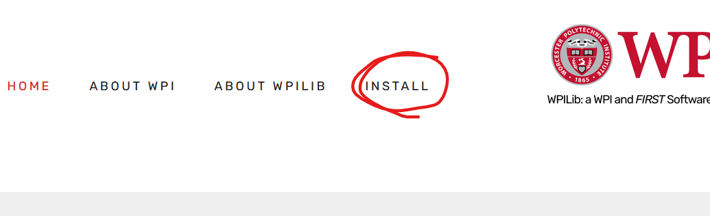

# Getting Started with 2026 AdvantageKit Sim

## What you'll need

* [ ] A computer that you can download things onto
* [x] Internet connection
* [ ] A game controller, ideally the one the driver will use for competitions


Since all game controllers are different, make sure you have the controller drivers installed if necessary. If you don't have a game controller you can use your computer's keyboard to control the simulation, but a game controller is better especially for swerve drive.


## 1. Download and install WPILib

Go to the [wpilib.org](http://wpilib.org) website and select Install.&#x20;



The website will redirect you to WPILib Documentation site.

In the WPILib Documentation there is a section called ZERO TO ROBOT with Step 2: Installing Software. Click on WPILib Installation Guide.

Scroll down to the section Downloading >> WPILib Installer. The bright blue rectangle button looks something like this and says Downloads:

.png>)

That button will redirect you to WPILib's Github. Scroll down until you see Downloads. It looks something like this:

.png>)

Click on Windows to download the installer for Windows 11.


If you look back at the WPILib Installation Guide, the documentation explains everything I summarize down here and they got pictures!


Double click the downloaded .iso file and open the WPILibInstaller.exe file.&#x20;

Click Start in the installer window.

Choose Install Mode Everything and Install for this User.

Choose Download for this computer only.

WPILib Installation finished!

## 2. Download AdvantageKit template

AdvantageKit is a special template to organize code designed by developed by Team 6328. AdvantageKit will help us do many useful things.

The AdvantageKit documentation at [docs.advantagekit.org](http://docs.advantagekit.org) has some template projects to help get started.

Go to [docs.advantagekit.org](http://docs.advantagekit.org) and find the link to go to AdvantageKit's Github in the top right corner.

.png>)

In the rightmost column, scroll down to find Releases and click on the latest release. It looks something like this:

.png>)

The latest release version will be at the top of the page. Under Assets we want to download AdvantageKit\_TalonFXSwerveTemplate.zip.

.png>)

Extract the file and it is ready to open in the next step.

## 3. Intro to Visual Studio Code aka VS Code

Open WPILib VS Code from your start menu. The icon is the WPILib logo symbol:

.png>)

Let's open the robot code we extracted from the zip. File >> Open Folder...

.png>)

Select the AdvantageKit\_TalonFXSwerveTemplate folder. If you double click on the folder, it will go inside the folder instead of opening it up in VS Code. You need to click the Select Folder button.

.png>)

The words **AdvantageKit\_TalonFXSwerveTemplate** appear at the top of our left column.

In the leftmost side of the window there is a column of icons. Select the icon that looks like the WPILib logo symbol aka WPILib Vendor Dependencies.

.png>)

Make sure these Vendor Dependencies are installed and updated To Latest:

* AdvantageKit
* CTRE-Phoenix (v6)
* PathplannerLib
* Studica
* WPILib-New-Commands

.png>)

In the top right corner, there are several icons in a row. Click the WPILib logo symbol icon aka Open WPILib Command Palette.

.png>)

The search bar at the top of the window (called Command Center) prompts you to start typing something. We want to type in Change Desktop Support Enabled Setting:

```
>WPILib: Change Desktop Support Enabled Setting
```

.png>)

VS Code prompts "Enable Desktop Support for Project?" We want Desktop Support to be "Currently true". Choose Yes.

.png>)

### 3.1 (optional) having git issues

I remember there was some issue related to Git when I first tried and failed to build my robot code. I had to download and install Git Bash (look up Git for Windows).&#x20;

Inside of VS Code there is a section at the bottom of the window with some tabs like PROBLEMS, OUTPUT, DEBUG CONSOLE. This is called the Panel. Choose TERMINAL and type in:

```
git init
```

Press enter, then do the same (type in and enter) for these two commands:

```
git add .
```

```
git commit -m "Initial commit"
```

## 4. Driving the robot in AdvantageScope

Plug in your game controller. It is helpful to make sure the game controller works first by opening an online gamepad tester. Search online and you'll find several websites where you can test to make sure you are getting controller input.

In VS Code, click the Open WPILib Command Palette icon in the top right, and this time we want to type in Simulate Robot Code:

.png>)

Once you click that command, VS Code will get busy compiling aka setting up the code so it will run. Once the code is done compiling, the Command Center will prompt you again. Check the box next to Sim GUI, then choose OK.

.png>)

A new window will pop up called Robot Simulation.

.png>)

Go back to VS Code. Click the Open WPILib Command Palette icon again, and this time we want to type Start Tool:

.png>)

The Command Center will prompt you to Pick a tool. Select AdvantageScope.&#x20;


AdvantageScope will open up in a new window.



The robot simulation only works when Robot Simulation is the active, selected window.


We need to look at AdvantageScope to see the sim but Robot Simulation needs to be the active window for the sim to work.

Rearrange the windows so that you can see what's going on in AdvantageScope but can also click on Robot Simulation to have it as the active window.

.png>)

Go to Robot Simulation and there will be a little window in the left area labeled System Joysticks. Your controller should show up as the first option.

There will be another little window inside Robot Simulation near the bottom labeled Joysticks.&#x20;

From System Joysticks, click and drag the name of your controller to Joystick\[0].

If you don't have a game controller, you can click and drag 16: Keyboard 0 to Joystick\[0] and use WASD to control the sim.

.png>)

Go to AdvantageScope and go to File >> Connect to Simulator >> Default: NetworkTables 4.

.png>)

Let's open up some visuals for the sim. There is a plus at the top right of AdvantageScope. Click the plus.

.png>)

Click 👀 3D Field to add a 3D simulation.

.png>)

Click and drag the virtual field to rotate the view. Right-click & drag will pan the view.

There are some options you can use to change the field type in the bottom right inside a drop down menu under Field.

.png>)

In the left column of AdvantageScope click the triangles to open up AdvantageKit >> RealOutputs >> Odometry >> Robot - Pose2D. Click and drag Robot - Pose2D to the box in the bottom area labeled Poses.

.png>)

A virtual robot should pop up on your 3D Field! If you click the triangle looking cursor you can change what your robot looks like.

.png>)

Now we can control the virtual robot with our game controller. Go back to the Robot Simulation window. There will be a little window in the top left area called Robot State. Click on Teleoperated to change the Robot State from Disconnected to Teleoperated, aka the robot mode that the drivers control with their controller.

.png>)


I always, **always** forget to do two things: 1. change robot state to Teleop and 2. make sure Robot Simulation is the active window. If you don't change the Robot State from Disconnected to Teleoperated (or Test), or you have AdvantageScope as your active window instead of Robot Simulation, you might think your code is broken when it isn't.


When you move the controller joysticks you should be able to drive the virtual robot around!

Left joystick: move left right forwards backwards

Right joystick: move left and right to rotate

.png>)
